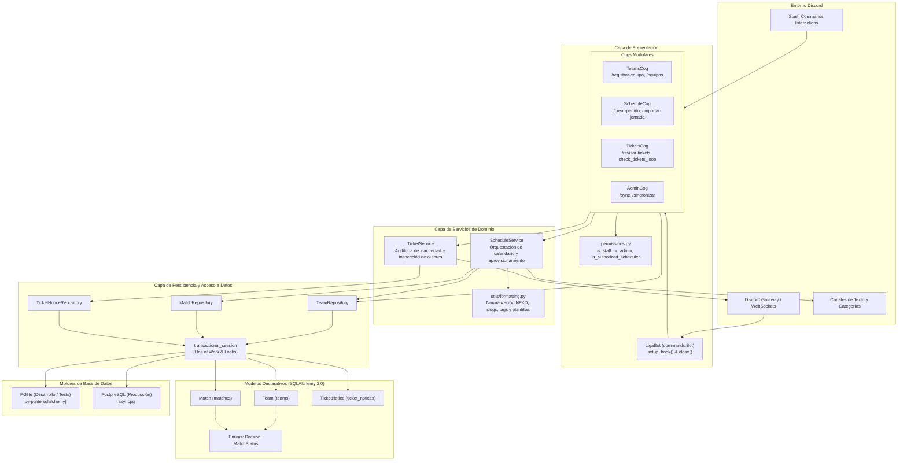
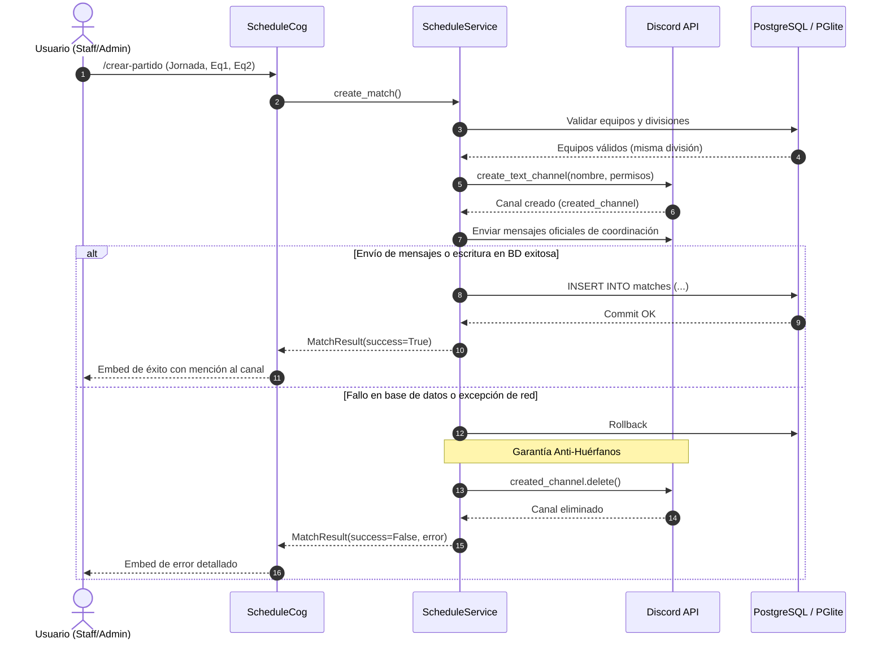

# Arquitectura del Sistema — LigaBot

Este documento detalla la arquitectura técnica, el modelo de capas, los flujos de interacción y las decisiones de diseño fundamentales que rigen la implementación de **LigaBot**, el bot modular de Discord para la liga RCL (Rift Champions League).

---

## 1. Visión General del Sistema

LigaBot está diseñado siguiendo una arquitectura en capas limpias (*Layered Architecture*) con separación de responsabilidades estricta. El objetivo es aislar la lógica de presentación del protocolo Discord de la lógica de dominio deportivo y la persistencia relacional, permitiendo pruebas unitarias deterministas, ejecución sobre motores de base de datos duales y máxima resiliencia ante fallos de la red o del Gateway.

### Diagrama Arquitectónico Global

---

## 2. Desglose de Capas

### 2.1 Capa de Presentación y Ciclo de Vida del Bot

La capa de presentación encapsula toda la interacción con la API de Discord mediante la biblioteca `discord.py`.

#### `LigaBot` (`src/liga_bot/bot.py`)
- **Subclase de `commands.Bot`**: Provee un punto de ensamblaje central para la inyección de dependencias y la configuración de ciclo de vida.
- **Intents Privilegiados**: Requiere explícitamente `intents.members = True` y `intents.message_content = True`. Estos intents son indispensables para resolver objetos `discord.Member`, inspeccionar roles de autores en canales de tickets y leer mensajes de coordinación.
- **Inyección de Dependencias Asíncrona en `setup_hook()`**:
  1. Inicializa el motor de base de datos (`AsyncEngine`) mediante `get_engine(self.settings)`.
  2. Inicializa la factoría de sesiones (`async_sessionmaker[AsyncSession]`).
  3. Instancia los servicios de dominio (`ScheduleService`, `TicketService`).
  4. Carga dinámicamente las extensiones configuradas (`DEFAULT_EXTENSIONS`: `admin`, `schedule`, `teams`, `tickets`).
- **Cierre Ordenado (*Graceful Shutdown*) en `close()`**:
  1. Localiza e interrumpe de forma limpia todas las tareas en segundo plano (`tasks.Loop.cancel()` y métodos `stop_loops()`) en los Cogs activos.
  2. Cierra y libera los recursos del motor de base de datos (`close_engine()`), finalizando el subproceso Node.js en caso de PGlite o eliminando el pool de conexiones en PostgreSQL.
  3. Llama a `super().close()` para desconectar el WebSocket de Discord y cerrar la sesión HTTP de `aiohttp`.
- **Desacoplamiento de `on_ready()`**: La sincronización de comandos con el servidor (`tree.sync()`) **no** se ejecuta en el evento `on_ready`. Esto previene límites de tasa agresivos (HTTP 429) cuando ocurren reconexiones del Gateway en producción. La sincronización se realiza bajo demanda mediante comandos administrativos.

#### Control de Permisos (`src/liga_bot/cogs/permissions.py`)
- Define funciones de comprobación asíncronas reutilizables:
  - `is_staff_or_admin(interaction, settings)`: Verifica si el usuario posee rol de Staff o Administrador.
  - `is_authorized_scheduler(interaction, settings)`: Verifica si el usuario posee rol de Staff, Administrador, o CEO de alguna de las divisiones (`CEO_PREMIER_ROLE_ID`, `CEO_ASCEND_ROLE_ID`).

---

### 2.2 Capa de Cogs (Extensiones de Comandos)

Cada Cog agrupa comandos relacionados con una responsabilidad específica:

| Cog | Archivo | Responsabilidad | Comandos Expuestos |
| :--- | :--- | :--- | :--- |
| **TeamsCog** | `src/liga_bot/cogs/teams.py` | Alta de equipos, asignación de roles de Discord y consulta de divisiones. | `/registrar-equipo`, `/equipos` |
| **ScheduleCog** | `src/liga_bot/cogs/schedule.py` | Creación de partidos individuales, importación masiva por CSV y aprovisionamiento de canales. | `/crear-partido`, `/importar-jornada`, `/crear-jornada` (alias) |
| **TicketsCog** | `src/liga_bot/cogs/tickets.py` | Auditoría de inactividad de tickets, bucle periódico de 24 horas y comando manual. | `/revisar-tickets`, `check_tickets_loop` |
| **AdminCog** | `src/liga_bot/cogs/admin.py` | Operaciones de mantenimiento, sincronización del árbol de comandos y diagnóstico. | `/sync`, `/sincronizar` (alias) |

---

### 2.3 Capa de Servicios de Dominio

Los servicios de dominio contienen la lógica de negocio pura y la orquestación de operaciones compuestas.

#### `ScheduleService` (`src/liga_bot/services/schedule_service.py`)
- **Validación de Reglas de Liga**:
  - Verifica que los dos equipos existan en la base de datos (por nombre insensible a mayúsculas o por slug normalizado).
  - Impide enfrentamientos entre un equipo y sí mismo (*self-play*).
  - Garantiza que ambos equipos pertenezcan a la **misma división** (rechaza cruces no permitidos entre Premier y Ascenso).
  - Comprueba la existencia física de los roles de Discord correspondientes a cada equipo.
- **Aprovisionamiento de Canales en Discord**:
  - Busca o crea la categoría de la jornada respetando el formato de división (`PREMIER - JORNADA X` o `ASCENSO - JORNADA X`).
  - Configura permisos estrictos (*Permission Overwrites*): canal privado para `@everyone`, acceso de lectura y escritura para los roles de ambos equipos, rol de Staff, rol de Administrador y el rol de CEO correspondiente a la división.
  - Publica los mensajes oficiales de coordinación (`format_mensaje_1` con acuerdo de horario y penalizaciones de convocatoria, y `format_mensaje_2` con reglas de Fearless Draft y enlace al reglamento).
- **Importación de CSV por Lotes**:
  - Procesa archivos CSV delimitados tanto por coma (`,`) como por punto y coma (`;`).
  - Maneja de forma transparente marcas de orden de bytes (`utf-8-sig`).
  - Tolera filas vacías y genera informes de auditoría detallados clasificando filas exitosas, omitidas por duplicidad y errores específicos de validación.

#### `TicketService` (`src/liga_bot/services/ticket_service.py`)
- **Detección de Inactividad**:
  - Escanea canales de texto ubicados bajo las categorías de tickets canónicas (`TICKETS-GENERAL-PREMIER`, `TICKETS-GENERAL-ASCEND`, `TICKETS-FICHAJES-PREMIER`, etc.).
  - Inspecciona el último mensaje enviado en el canal. Si la diferencia entre `discord.utils.utcnow()` y `mensaje.created_at` es mayor o igual a 24 horas, el canal califica como candidato a aviso.
- **Resolución Resiliente de Autores**:
  - Determina si el último autor es miembro del personal técnico o directivo.
  - Implementa estrategia de caché local (`guild.get_member`) con degradación suave a llamada de API (`guild.fetch_member`).
  - Si el autor es Staff, Admin, CEO o el propio bot, la alerta se omite (el ticket no está desatendido).
- **Prevención de Spam e Idempotencia**:
  - Utiliza la tabla `ticket_notices` para registrar la fecha del último aviso enviado (`last_alert_sent_at`).
  - Si ya se envió una alerta en las últimas 24 horas, no se vuelve a notificar.
- **Control de Tasa (*Throttling*)**:
  - Aplica una pausa obligatoria (`await asyncio.sleep(0.3)`) entre cada canal escaneado para respetar las cuotas de peticiones de la API de Discord.

---

### 2.4 Capa de Persistencia y Repositorios

- **Patrón Repositorio**: Desacopla las operaciones de consulta y escritura del ORM subyacente.
  - `TeamRepository`: Inserción, actualización por rol o nombre, listado por división y búsqueda por slug.
  - `MatchRepository`: Búsqueda simétrica de partidos por jornada y equipos, control de ciclo de vida (`status`), y carga voraz (*eager loading*) segura mediante `selectinload` para contextos asíncronos.
  - `TicketNoticeRepository`: Inserción idempotente de alertas, registro de respuestas de staff y consulta de tickets pendientes.
- **Gestión Transaccional (`transactional_session`)**:
  - Context manager que encapsula bloques `async with session.begin():`.
  - Asegura que si cualquier operación dentro del bloque falla, se ejecute un `ROLLBACK` total en la base de datos.
  - En motores de conexión única (como PGlite o `StaticPool`), adquiere automáticamente un `asyncio.Lock` para serializar transacciones concurrentes y prevenir bloqueos internos del motor.

---

### 2.5 Capa de Modelos y Utilidades

- **Modelos Declarativos (`src/liga_bot/models/`)**: Construidos sobre `DeclarativeBase` con `Mapped` y `mapped_column` tipados.
- **Utilidades de Normalización (`src/liga_bot/utils/formatting.py`)**:
  - Normalización Unicode **NFKD** para convertir caracteres acentuados o diacríticos en caracteres ASCII base.
  - Generación de slugs para nombres de canales (`normalize_slug`), colapsando caracteres especiales y guiones repetidos.
  - Validación y acotación estricta de tags (`normalize_tag`) a un máximo de 4 caracteres.
  - Plantillas de mensajes oficiales de coordinación deportiva con firmas de compatibilidad amplia.

---

## 3. Decisiones Clave de Diseño

### 3.1 Estrategia de Motores Duales (PostgreSQL + PGlite)

Para optimizar el ciclo de desarrollo y pruebas, el sistema implementa una abstracción transparente:

1. **Entorno de Pruebas y Desarrollo Local**: Utiliza **PGlite** (`py-pglite[sqlalchemy]`), una implementación de PostgreSQL 17 compilada a WebAssembly que corre directamente dentro del proceso de Python.
   - Ventaja: No requiere levantar contenedores Docker ni configurar servicios externos.
   - Conexión en memoria: `DATABASE_URL=pglite:///:memory:` (tiempo de arranque de milisegundos, pruebas 100% aisladas e idempotentes).
   - Serialización de Transacciones: Dado que PGlite opera sobre una única conexión subyacente, el módulo `database.py` detecta si el motor requiere serialización (`_requires_serialization`) y utiliza un candado asíncrono (`asyncio.Lock`) para evitar que múltiples corrutinas intenten abrir transacciones concurrentes simultáneamente.
2. **Entorno de Producción**: Utiliza **PostgreSQL** estándar mediante el driver asíncrono `asyncpg`.
   - Soporta agrupamiento de conexiones (*connection pooling*) de alta concurrencia mediante `AsyncAdaptedQueuePool` con verificación periódica (`pool_pre_ping=True`).

### 3.2 Garantía Anti-Huérfanos en Creación de Canales

En sistemas que interactúan simultáneamente con una API externa (Discord) y una base de datos relacional, existe el riesgo de inconsistencia si la base de datos rechaza la transacción después de haber creado el canal en Discord.

LigaBot implementa una política estricta de reversión:

Si ocurre cualquier excepción después de la llamada `guild.create_text_channel()`, el bloque `except` captura el fallo, ejecuta `await created_channel.delete()` de inmediato y registra la incidencia antes de retornar el resultado fallido.

### 3.3 Ciclo de Vida y Auditoría de Tickets

El sistema de soporte maneja canales de consulta y fichajes para evitar que queden solicitudes desatendidas:

1. **Umbral de 24 Horas**: Se calcula el tiempo transcurrido desde el último mensaje registrado en el canal.
2. **Exclusión de Personal**: Si el último autor posee rol de Staff, Administrador, CEO o es el bot, se interpreta que el ticket ya cuenta con respuesta del equipo organizador.
3. **Supresión de Spam**: Si el canal ya recibió una notificación de advertencia en las últimas 24 horas, se consulta la tabla `ticket_notices` para evitar reenviar alertas consecutivas.
4. **Control de Frecuencia (*Throttling*)**: Para evitar ser bloqueado por la API de Discord al auditar decenas de canales simultáneamente, se aplica una pausa intencionada de 0.3 segundos por canal.
5. **Autoreparación del Bucle en Segundo Plano**: En caso de que una excepción no controlada afecte el bucle `tasks.loop`, el manejador `@check_tickets_loop.error` detecta la caída y reinicia el bucle de forma transparente.

### 3.4 Restricciones Defensivas de Embeds y Contención de Excepciones

- **Límites de Discord API**: Los campos de los embeds de Discord tienen una limitación rígida de **1024 caracteres** por valor de campo (`Field.value`). Si una jornada contiene decenas de partidos o una auditoría detecta numerosos tickets, la información se trunca defensivamente concatenando sufijos como `\n*... (truncado por límite de Discord)*` para garantizar que la respuesta nunca falle con un error `HTTP 400 Bad Request`.
- **Diferimiento Seguro de Interacciones**: Todas las operaciones complejas (importación de CSV, auditorías de canales) invocan `await interaction.response.defer(ephemeral=True)` antes de iniciar el procesamiento. De este modo, la interacción no expira por el límite de 3 segundos de Discord y las respuestas posteriores se entregan mediante `interaction.followup.send`.
- **Contención de Excepciones**: Los comandos slash envuelven la llamada a los servicios en bloques `try...except Exception` que capturan cualquier excepción imprevista y emiten un embed de error con la traza reducida, evitando que el comando quede congelado en estado "El bot está pensando...".
