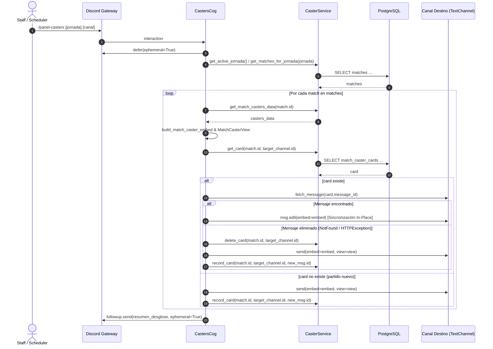

# Comandos de Cartelera y Casters (`CastersCog`)

[⬅️ Volver a Cartelera y Casters](./README.md)

El subsistema de comandos de cartelera está implementado en `src/liga_bot/cogs/casters.py` a través de la clase `CastersCog`. Proporciona los puntos de entrada slash para la publicación interactiva, actualización in-place y sincronización de horarios de las tarjetas de partidos destinadas a los equipos de retransmisión y casteo.

---

## 1. Arquitectura y Ciclo de Vida (`CastersCog`)

La clase `CastersCog` extiende `discord.ext.commands.Cog` y centraliza los comandos de aplicación (`app_commands`) del bot relacionados con la cartelera audiovisual.

- **Ubicación**: `src/liga_bot/cogs/casters.py:30-208` (207 líneas brutas, 177 SLOC).
- **Extensión oficial**: Registrada en `DEFAULT_EXTENSIONS` (`src/liga_bot/bot.py:36`).
- **Compatibilidad e inyección**: Admite la inyección opcional de `bot`, `caster_service`, `session_factory` y `settings`.

### 1.1 Inyección de Dependencias Resiliente

Si los servicios o factorías no se suministran explícitamente en el constructor, se resuelven de forma desacoplada y perezosa a través de propiedades:

```python
@property
def session_factory(self) -> async_sessionmaker[AsyncSession]:
    if self._session_factory is not None:
        return self._session_factory
    bot_factory = getattr(self.bot, "session_factory", None)
    if bot_factory is not None:
        return bot_factory
    return get_session_factory()


@property
def caster_service(self) -> CasterService:
    if self._caster_service is not None:
        return self._caster_service
    service = getattr(self.bot, "caster_service", None)
    if service is not None:
        return service
    self._caster_service = CasterService(
        session_factory=self.session_factory,
        settings=self.settings,
        bot=self.bot,
    )
    return self._caster_service
```

### 1.2 Registro del Botón Dinámico en `cog_load`

Para que Discord.py pueda enrutar las interacciones de botones en mensajes previamente publicados tras un reinicio del proceso del bot, `CastersCog` registra el elemento dinámico en su hook de carga (`src/liga_bot/cogs/casters.py:70-72`):

```python
async def cog_load(self) -> None:
    """Registra el DynamicItem de botones de caster en el bot."""
    self.bot.add_dynamic_items(CasterActionButton)
```

### 1.3 Carga Segura e Idempotente (`setup`)

La función `setup` (`src/liga_bot/cogs/casters.py:204-208`) valida la existencia previa del cog antes de añadirlo a la colección del cliente:

```python
async def setup(bot: LigaBot | commands.Bot) -> None:
    """Función de carga estándar de extensión de discord.py con guard de idempotencia."""
    if "CastersCog" not in bot.cogs:
        await bot.add_cog(CastersCog(bot))
```

Esta comprobación previene errores `CommandRegistrationError` durante recargas dinámicas de módulos en tiempo de ejecución.

---

## 2. Control de Acceso y Autorización

Los comandos de cartelera aplican un doble anillo de seguridad antes de ejecutar cualquier operación sobre el canal o la base de datos:

1. **Permiso nativo de Discord**: Configurado mediante `@app_commands.default_permissions(manage_guild=True)` en la declaración del comando, limitando su visibilidad en el autocompletado del cliente a miembros con privilegios de gestión de servidor.
2. **Contexto de Servidor Requerido**: El comando rechaza interacciones fuera de servidores (ej. mensajes directos):
   ```python
   if interaction.guild is None:
       await interaction.response.send_message(
           "❌ Este comando solo puede ser ejecutado dentro de un servidor de Discord.",
           ephemeral=True,
       )
       return
   ```
3. **Verificación Programática de Roles Staff/Scheduler**: Invoca `is_authorized_scheduler(interaction, self.settings)` (`src/liga_bot/cogs/permissions.py:167-190`). Para ser admitido, el usuario invocador debe contar con al menos uno de los siguientes privilegios:
   - Permiso nativo de Administrador de Discord (`guild_permissions.administrator`).
   - Rol de Staff (`settings.staff_role_id`).
   - Rol de Administrador (`settings.admin_role_id`).
   - Rol de CEO Premier (`settings.ceo_premier_role_id`).
   - Rol de CEO Ascend (`settings.ceo_ascend_role_id`).

Si el usuario no cumple ninguna de las condiciones anteriores, la interacción responde con un mensaje efímero de error:  
`"❌ No tienes permisos para gestionar la cartelera de casters."`

---

## 3. Catálogo de Comandos Slash

### 3.1 `/panel-casters`

Publica o actualiza la cartelera interactiva de casters para los enfrentamientos de una jornada específica en un canal de texto designado.

- **Ubicación**: `src/liga_bot/cogs/casters.py:74-91`.
- **Firma**:
  ```python
  @app_commands.command(
      name="panel-casters",
      description="Publica o actualiza la cartelera interactiva de casters para una jornada",
  )
  @app_commands.describe(
      jornada="Número de la jornada a publicar (opcional, por defecto la última activa)",
      canal="Canal de texto de destino (opcional, por defecto el canal configurado)",
  )
  @app_commands.default_permissions(manage_guild=True)
  async def panel_casters(
      self,
      interaction: discord.Interaction,
      jornada: int | None = None,
      canal: discord.TextChannel | None = None,
  ) -> None:
      await self._panel_casters_impl(interaction, jornada, canal)
  ```

#### Parámetros

| Parámetro | Tipo | Requerido | Valor por Defecto | Descripción y Comportamiento |
|---|---|:---:|---|---|
| `jornada` | `int` | No | `None` (auto-resolución) | Número ordinal de la jornada a procesar. Si se omite, se invoca `CasterService.get_active_jornada()`, resolviendo la jornada máxima registrada (`SELECT MAX(jornada) FROM matches`). Si la base de datos carece de partidos, se notifica el fallo efímeramente. |
| `canal` | `discord.TextChannel` | No | `None` (auto-resolución) | Canal de texto de Discord donde se alojarán las tarjetas. Si se omite, intenta resolver `settings.casters_channel_id` (por defecto `1550210628361392278`); si dicho ID no existe en el guild o no es accesible, recurre a `interaction.channel`. |

---

### 3.2 `/cartelera-casters`

Alias idéntico en funcionalidad, opciones y validaciones que `/panel-casters`, proporcionado para conveniencia del equipo de administración.

- **Ubicación**: `src/liga_bot/cogs/casters.py:93-109`.
- **Firma**:
  ```python
  @app_commands.command(
      name="cartelera-casters",
      description="Alias de /panel-casters: publica o actualiza la cartelera de casters",
  )
  @app_commands.describe(
      jornada="Número de la jornada a publicar (opcional, por defecto la última activa)",
      canal="Canal de texto de destino (opcional, por defecto el canal configurado)",
  )
  @app_commands.default_permissions(manage_guild=True)
  async def cartelera_casters(
      self,
      interaction: discord.Interaction,
      jornada: int | None = None,
      canal: discord.TextChannel | None = None,
  ) -> None:
      await self._panel_casters_impl(interaction, jornada, canal)
  ```

---

## 4. Flujo de Ejecución y Publicación Incremental (`_panel_casters_impl`)

El método interno `_panel_casters_impl` (`src/liga_bot/cogs/casters.py:110-202`) orquesta el ciclo de vida completo de la publicación:



### 4.1 Fases del Procesamiento

1. **Aplazamiento de Interacción (`defer`)**:  
   Se ejecuta de inmediato `await interaction.response.defer(ephemeral=True)`. Esto previene el timeout estricto de 3 segundos de la API de Discord mientras se realizan consultas asíncronas y operaciones de red contra los canales.
2. **Resolución de Canal de Destino**:  
   Se evalúa la precedencia: parámetro `canal` > `interaction.guild.get_channel(settings.casters_channel_id)` > `interaction.channel`. Si el objeto resultante es nulo o carece de método `send`, la operación se aborta con error efímero.
3. **Resolución de Jornada y Partidos**:  
   Si `jornada` es `None`, se consulta `get_active_jornada()`. Si no se detectan jornadas, responde: `"⚠️ No hay jornadas activas ni partidos registrados en la base de datos."`. Si la jornada resuelta no contiene partidos, responde: `"⚠️ No hay partidos programados para la Jornada {resolved_jornada}."`.
4. **Bucle de Tarjetas e Idempotencia**:  
   Itera cronológicamente sobre los partidos obtenidos (`get_matches_for_jornada`). Para cada partido:
   - Consulta el estado actual de cobertura mediante `get_match_casters_data(match.id)`.
   - Genera el embed visual (`build_match_caster_embed`) y la vista (`MatchCasterView`).
   - Consulta `get_card(match.id, target_channel.id)` en la tabla `match_caster_cards`.
5. **Bifurcación de Sincronización vs Publicación**:
   - **Caso A (Tarjeta previamente registrada)**:
     - Realiza `await target_channel.fetch_message(card.message_id)`.
     - Si el mensaje responde con éxito en Discord: ejecuta `await msg.edit(embed=embed)`. Esto actualiza cualquier cambio en la base de datos (por ejemplo, si el horario `scheduled_at` fue modificado o reprogramado) sin alterar la vista ni los casters asignados. Incrementa el contador `synced_count`.
     - Si el mensaje lanza `discord.NotFound` o `discord.HTTPException`: el mensaje fue purgado manualmente de Discord. El sistema entra en modo de **autorreparación (*self-healing*)**: elimina la tarjeta huérfana de la base de datos (`delete_card`), publica un nuevo mensaje en el canal (`target_channel.send`) y registra el nuevo identificador (`record_card`). Incrementa `published_count`.
   - **Caso B (Partido sin tarjeta previa)**:
     - Publica un mensaje nuevo con `await target_channel.send(embed=embed, view=view)`.
     - Inserta el registro en `match_caster_cards` vía `record_card`. Incrementa `published_count`.
6. **Resumen de Resultados al Invocador**:  
   Emite un reporte efímero final indicando el total de tarjetas publicadas y sincronizadas:
   ```text
   ✅ Panel de casters actualizado para la Jornada 3 en #cartelera-casters:
   - 🆕 Tarjetas publicadas: 2
   - 🔄 Tarjetas sincronizadas/actualizadas: 3
   ```

---

## 5. Matriz de Respuestas Efímeras y Casos de Error

| Escenario | Condición de Activación | Respuesta Emitida al Usuario |
|---|---|---|
| Invocación en MD | `interaction.guild is None` | `"❌ Este comando solo puede ser ejecutado dentro de un servidor de Discord."` |
| Permisos insuficientes | `not is_authorized_scheduler(...)` | `"❌ No tienes permisos para gestionar la cartelera de casters."` |
| Canal inválido | Canal resuelto es `None` o carece de `send` | `"❌ No se pudo determinar un canal válido para publicar la cartelera."` |
| Sin jornadas activas | `jornada is None` y `get_active_jornada() is None` | `"⚠️ No hay jornadas activas ni partidos registrados en la base de datos."` |
| Jornada vacía | `get_matches_for_jornada(jornada)` retorna lista vacía | `"⚠️ No hay partidos programados para la Jornada {jornada}."` |
| Éxito operativo | Bucle finalizado con al menos 1 partido procesado | `"✅ Panel de casters actualizado para la **Jornada {j}** en {canal}:\n- 🆕 Tarjetas publicadas: **{p}**\n- 🔄 Tarjetas sincronizadas/actualizadas: **{s}**"` |
