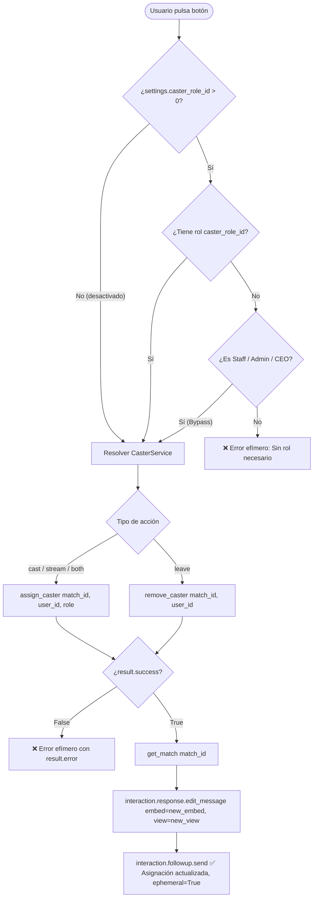

# Componentes de Interfaz de Usuario (UI): Cartelera y Casters

[⬅️ Volver a Cartelera y Casters](./README.md)

Los componentes interactivos de Discord para la cartelera de retransmisiones residen en `src/liga_bot/ui/casters.py` (340 líneas brutas, 272 SLOC). Utilizan las capacidades modernas de `discord.py` 2.4+: embeds enriquecidos con marcas de tiempo relativas, vistas persistentes de duración indefinida (`timeout=None`), botones dinámicos deserializables post-reinicio (`discord.ui.DynamicItem`) y actualización reactiva in-place de mensajes (`edit_message`).

---

## 1. Inventario de Componentes UI

| Componente | Tipo / Primitiva | Persistencia / Timeout | Responsabilidad Funcional |
|---|---|---|---|
| `build_match_caster_embed` | Función constructora (`discord.Embed`) | N/A (generación en memoria) | Formatea la tarjeta visual del partido con división, jornada, equipos, horario relativo, estado de retransmisión, casters y badge de cobertura. |
| `MatchCasterView` | `discord.ui.View` | Persistente (`timeout=None`) | Contenedor de los 4 botones de acción para cada partido. Gestiona el estado habilitado/deshabilitado de los botones de stream. |
| `CasterActionButton` | `discord.ui.DynamicItem` | Persistente (regex `custom_id`) | Botón interactivo que atiende clics de asignación y desasignación, valida roles en caliente, invoca al servicio y edita el mensaje in-place. |

---

## 2. Generador de Embed: `build_match_caster_embed`

- **Ubicación**: `src/liga_bot/ui/casters.py:56-137`.
- **Firma**:
  ```python
  def build_match_caster_embed(match: Match, casters_data: MatchCastersData) -> discord.Embed:
  ```

### 2.1 Lógica de Resolución Defensiva del Título

El título del embed sigue el patrón canónico:  
`"{division_name} · Jornada {jornada} · {team1} vs {team2}"`

Para tolerar distintos niveles de precarga relacional en la entidad `Match`, el generador implementa resolución en cascada:
1. **División**:
   - Si `match.season_division` está presente: consulta `match.season_division.division.name` o `match.season_division.division_name`.
   - Si solo existe `match.division`: consulta `match.division.value` o `str(match.division)`.
   - Fallback defensivo: `"División"`.
2. **Equipos**:
   - `team1`: `match.team1.name` si está cargado; en su defecto `"Equipo 1"`.
   - `team2`: `match.team2.name` si está cargado; en su defecto `"Equipo 2"`.
3. **Jornada**:
   - `match.jornada` si existe; en su defecto `1`.

### 2.2 Matriz de Cobertura, Estados y Códigos de Color

El color del embed y la insignia del campo `Estado` se calculan dinámicamente según la presencia de streamer y casters:

| `has_streamer` | `has_casters` (`len > 0`) | Código de Color Discord | Insignia y Valor del Campo `Estado` |
|:---:|:---:|---|---|
| **True** | **True** | `discord.Color.green()` | `🟢 Cobertura lista (Streamer + Casters)` |
| **True** | **False** | `discord.Color.gold()` | `🟡 Falta caster (solo retransmisión)` |
| **False** | **True** | `discord.Color.gold()` | `🟡 Falta retransmisión (solo audio)` |
| **False** | **False** | `discord.Color.blurple()` | `⚪ Vacante (sin cubrir)` |

### 2.3 Estructura Detallada de Campos del Embed

```text
┌─────────────────────────────────────────────────────────────┐
│ Premier · Jornada 3 · Vanguard Gaming vs Nexus Esports      │
│                                                             │
│ Horario                                                     │
│ <t:1727632800:F> (<t:1727632800:R>)                         │
│                                                             │
│ 📺 Retransmisión             🎙️ Casters                     │
│ <@123456789> (Solo PC)       <@987654321>, <@111222333>     │
│                                                             │
│ Estado                                                      │
│ 🟢 Cobertura lista (Streamer + Casters)                     │
│                                                             │
│ RCL · Rebel Crown Legacy                                    │
└─────────────────────────────────────────────────────────────┘
```

1. **`Horario`** (`inline=False`):
   - Si `match.scheduled_at` está definido: formatea marcas temporales de Discord: `<t:{ts}:F> (<t:{ts}:R>)` (fecha completa y cuenta atrás relativa).
   - Si `match.scheduled_at` es nulo: muestra el texto italicizado `*Por determinar*`.
2. **`📺 Retransmisión`** (`inline=True`):
   - Si `has_streamer` es `True`:
     - Si el rol asignado es `CasterRole.STREAMER`: `<@{discord_user_id}> (Solo PC)`
     - Si el rol asignado es `CasterRole.BOTH`: `<@{discord_user_id}> (Caster + PC)`
     - Fallback de rol: `<@{discord_user_id}>`
   - Si `has_streamer` es `False`: `*Vacante (disponible)*`
3. **`🎙️ Casters`** (`inline=True`):
   - Si la lista `casters_data.casters` contiene elementos: lista separada por comas de menciones de usuario (`<@{discord_user_id}>`).
   - Si la lista está vacía: `*Sin casters asignados*`.
4. **`Estado`** (`inline=False`):
   - Muestra el texto resultante de la matriz de cobertura (punto 2.2).
5. **Pie de página (`footer`)**:
   - `text="RCL · Rebel Crown Legacy"`.

---

## 3. Vista Interactiva: `MatchCasterView`

- **Ubicación**: `src/liga_bot/ui/casters.py:302-341`.
- **Firma**:
  ```python
  class MatchCasterView(discord.ui.View):
      def __init__(
          self,
          match_id: UUID | str,
          casters_data: MatchCastersData | None = None,
      ) -> None:
          super().__init__(timeout=None)
  ```

### 3.1 Comportamiento y Persistencia

1. **Tiempo de Expiración Infinito (`timeout=None`)**:  
   Garantiza que la vista no se desactive por inactividad. Los botones continúan respondiendo permanentemente mientras el mensaje siga publicado.
2. **Desactivación Reactiva de Botones de Stream**:  
   Determina si existe un streamer asignado evaluando `casters_data.has_streamer`:
   - `btn_cast` (`Castear`): siempre habilitado (`disabled=False`).
   - `btn_stream` (`Retransmitir`): deshabilitado en caliente (`disabled=True`) si `has_streamer=True`; habilitado si `has_streamer=False`.
   - `btn_both` (`Ambas mezcladas`): deshabilitado en caliente (`disabled=True`) si `has_streamer=True`; habilitado si `has_streamer=False`.
   - `btn_leave` (`Desapuntarse`): siempre habilitado (`disabled=False`).

   La vista se reconstruye con este estado en dos momentos: al pulsar cualquier botón (sección 4) y al resincronizar la cartelera con `/panel-casters` o `/cartelera-casters`, que edita cada tarjeta existente con `msg.edit(embed=embed, view=view)` (ver [`commands.md`](commands.md)).

---

## 4. Botón Dinámico Deserializable: `CasterActionButton`

- **Ubicación**: `src/liga_bot/ui/casters.py:139-300`.
- **Herencia**: `discord.ui.DynamicItem[discord.ui.Button[Any]]`.
- **Plantilla Regex de Custom ID**:
  ```python
  template = r"^caster:(?P<action>cast|stream|both|leave):(?P<match_id>[0-9a-fA-F-]+)$"
  ```

### 4.1 Configuración de Acciones y Estilos (`ACTION_CONFIG`)

Cada acción define visualmente su etiqueta, emoji y estilo de botón de Discord:

| Acción (`action`) | Etiqueta | Emoji | Estilo Discord (`ButtonStyle`) | Color Visual | Rol Asignado (`CasterRole`) |
|---|---|:---:|---|---|---|
| `cast` | `Castear` | 🎙️ | `primary` | Azul (Blurple) | `CasterRole.CASTER` |
| `stream` | `Retransmitir` | 📺 | `secondary` | Gris | `CasterRole.STREAMER` |
| `both` | `Ambas mezcladas` | 🎬 | `success` | Verde | `CasterRole.BOTH` |
| `leave` | `Desapuntarse` | ❌ | `danger` | Rojo | *Ninguno (eliminación)* |

### 4.2 Deserialización en Caliente tras Reinicio (`from_custom_id`)

Cuando un usuario interactúa con un botón en un mensaje publicado antes del último reinicio del bot, Discord Gateway envía el evento de interacción con el `custom_id` almacenado. La factoría de clase de `DynamicItem` reconstruye la instancia sin consultar la base de datos:

```python
@classmethod
async def from_custom_id(
    cls,
    interaction: discord.Interaction,
    item: discord.ui.Item[Any],
    match: re.Match[str],
    /,
) -> CasterActionButton:
    action = match["action"]
    match_id = UUID(match["match_id"])
    disabled = getattr(item, "disabled", False)
    return cls(action=action, match_id=match_id, disabled=disabled)
```

### 4.3 Flujo de Ejecución del Callback (`callback`)



1. **Filtro de Rol de Caster con Bypass de Staff**:
   Si `settings.caster_role_id` está configurado (`> 0`), verifica si el miembro posee dicho rol en Discord. Si no lo posee, evalúa `is_staff(interaction, settings)`. Si no es miembro del Staff, interrumpe el flujo y responde efímeramente:  
   `"❌ No tienes el rol necesario para apuntarte como caster."`  
   *(Si `settings.caster_role_id == 0`, la verificación se omite por completo, permitiendo el casteo a cualquier miembro).*
2. **Ejecución del Servicio de Dominio**:
   Invoca `caster_service.assign_caster` o `caster_service.remove_caster`. Si la operación fracasa (ej. intento concurrente de tomar una retransmisión ya ocupada), responde efímeramente con el mensaje de error del dominio.
3. **Actualización In-Place del Mensaje**:
   Recupera la entidad actualizada del partido (`get_match`), regenera el embed (`build_match_caster_embed`) y la vista (`MatchCasterView`). Ejecuta `await interaction.response.edit_message(embed=updated_embed, view=updated_view)`. Si la respuesta ya fue diferida, recurre a `interaction.edit_original_response`.
4. **Confirmación Efímera Secundaria**:
   Envía un mensaje de seguimiento efímero y privado:  
   `"✅ Tu asignación ha sido actualizada."`

---

## 5. Casos de Borde y Excepciones de Dominio

- **Concurrencia entre Streamers (Click Simultáneo)**: Si dos usuarios pulsan `Retransmitir` en el mismo milisegundo sobre una tarjeta vacante, el primero en completar la transacción adquiere el puesto. La transacción del segundo detecta la ocupación (en servicio o por choque en el índice `uq_match_casters_single_streamer`) y responde de forma aislada y efímera:  
  `"❌ Ya hay una persona asignada a la retransmisión de este partido."`  
  El embed no se corrompe y el segundo usuario no queda asignado.
- **Desapuntado Idempotente**: Si un usuario pulsa `Desapuntarse` sin estar previamente asignado al partido, el servicio procesa la solicitud sin error (`success=True`), reconstruye el embed y confirma la actualización sin alterar los datos existentes.
- **Partido Eliminado**: Si un partido es purgado de la base de datos mientras una tarjeta sigue visible en Discord y un usuario interactúa con ella, el botón recibe un resultado fallido del servicio y emite efímeramente:  
  `"❌ No se encontró la información del partido."`
