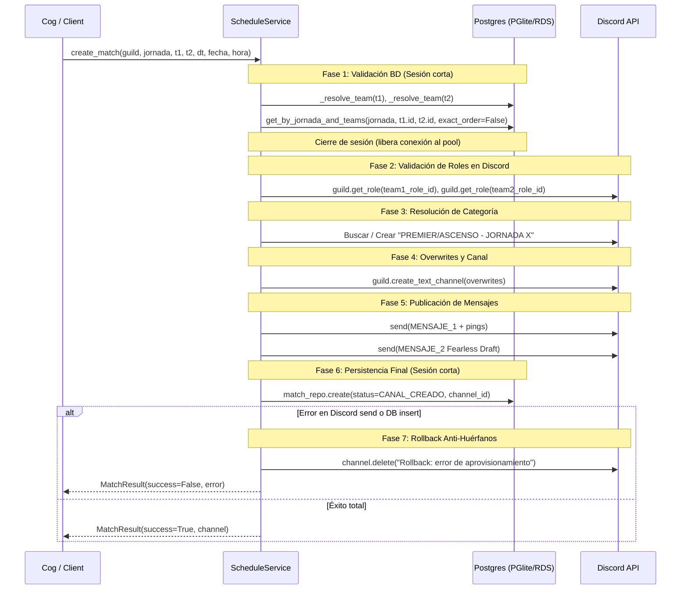

# Servicios de Dominio de Calendario (`ScheduleService`)

El servicio de dominio para el aprovisionamiento, validación y gestión de calendario en LigaBot está implementado en `src/liga_bot/services/schedule_service.py` a través de la clase `ScheduleService`, complementado por las utilidades de formateo y plantillas en `src/liga_bot/utils/formatting.py`.

---

## 1. Arquitectura y Modelos de Transferencia de Datos (DTOs)

`ScheduleService` encapsula las reglas de negocio de la competición deportiva, la sincronización relacional en PostgreSQL y la orquestación de la API de Discord. Para comunicar resultados y errores desacoplados de la capa de transporte o interfaz de usuario, define tres DTOs (`slots=True`):

```python
@dataclass(slots=True)
class MatchError(Exception):
    message: str
    row: int | None = None
    team1_name: str | None = None
    team2_name: str | None = None


@dataclass(slots=True)
class MatchResult:
    success: bool
    jornada: int
    team1_name: str
    team2_name: str
    match: Match | None = None
    channel: discord.TextChannel | None = None
    channel_mention: str | None = None
    error: str | None = None
    is_duplicate: bool = False


@dataclass(slots=True)
class JornadaResult:
    jornada: int
    total_rows: int
    matches: list[MatchResult] = field(default_factory=list)
    errors: list[str] = field(default_factory=list)

    @property
    def success_count(self) -> int:
        return sum(1 for m in self.matches if m.success)

    @property
    def error_count(self) -> int:
        return len(self.errors)
```

---

## 2. Resolución de Equipos y Fallbacks

El método auxiliar `_resolve_team` (`src/liga_bot/services/schedule_service.py:99-106`) proporciona resolución flexible de entidades `Team` admitiendo nombres oficiales o identificadores slug:

```python
async def _resolve_team(self, team_repo: TeamRepository, name_or_slug: str) -> Team | None:
    cleaned = name_or_slug.strip()
    team = await team_repo.get_by_name(cleaned, case_sensitive=False)
    if team is not None:
        return team
    slug_guess = normalize_slug(cleaned)
    return await team_repo.get_by_slug(slug_guess)
```

1. **Búsqueda primaria**: Consulta insensible a mayúsculas por el campo `name` en la tabla `teams`.
2. **Búsqueda secundaria (fallback)**: Normaliza la entrada a formato slug con NFKD (`normalize_slug`) y consulta por la columna `slug`. Esto permite resolver equipos introducidos con variaciones ortográficas, emojis o tildes.

---

## 3. Orquestación de Creación de Partido: `create_match`

El método `create_match` (`src/liga_bot/services/schedule_service.py:108-367`) implementa un flujo multifásico desacoplado y protegido contra bloqueos de base de datos y canales huérfanos.

### 3.1 Diagrama de Secuencia



### 3.2 Desglose de Fases

#### Fase 1: Validación Transaccional en Base de Datos (`schedule_service.py:123-201`)
Se abre una sesión corta mediante `async with transactional_session(self.session_factory) as session:`.
1. **Existencia de equipos**: Valida que tanto `team1` como `team2` existan en la base de datos. Si alguno falta, retorna `MatchResult(success=False, error=...)`.
2. **Auto-enfrentamiento**: Valida `team1.id != team2.id`. Si coinciden, aborta con `"Un equipo no puede enfrentarse a sí mismo ('{team1.name}')."`.
3. **Coherencia de división**: Valida `team1.division == team2.division`. Si pertenecen a divisiones distintas (ej. uno en `PREMIER` y otro en `ASCEND`), aborta con un mensaje de conflicto de división.
4. **Detección simétrica de duplicados**: Invoca `match_repo.get_by_jornada_and_teams(jornada, team1.id, team2.id, exact_order=False)`. Si ya existe un enfrentamiento previo entre ambos equipos en cualquier orden (`t1 vs t2` O `t2 vs t1`), retorna inmediatamente `is_duplicate=True` sin interactuar con Discord.
5. **Aislamiento de conexión**: Extrae en variables locales escalares los datos necesarios (`division`, `role_ids`, `slugs`, `ids`, `names`) y **cierra inmediatamente la sesión de base de datos**. Esto previene el acaparamiento de conexiones del pool mientras se realizan llamadas de red a la API de Discord.

#### Fase 2: Validación de Roles en Discord (`schedule_service.py:203-227`)
Obtiene `role1 = guild.get_role(team1_role_id)` y `role2 = guild.get_role(team2_role_id)`. Si alguno de los roles configurados en la base de datos no existe en el servidor de Discord, aborta la operación reportando el ID de rol faltante.

#### Fase 3: Resolución de Categoría (`schedule_service.py:229-251`)
Determina el nombre canónico de la categoría según la división deportiva:
- `PREMIER`: `"PREMIER - JORNADA {jornada}"`
- `ASCEND`: `"ASCENSO - JORNADA {jornada}"` (acepta alternativamente `"ASCEND - JORNADA {jornada}"`)

Busca la categoría en memoria sobre `guild.categories`. Si no existe, la crea mediante `await guild.create_category(category_name)`.

#### Fase 4: Matriz de Permisos (*Overwrites*) (`schedule_service.py:254-286`)
Aplica una política de mínimo privilegio para garantizar la confidencialidad de la coordinación:

| Entidad / Rol | `view_channel` | `send_messages` | `embed_links` | Justificación |
|---|:---:|:---:|:---:|---|
| `@everyone` (`default_role`) | `False` | — | — | Canal cerrado al público general. |
| `role1` (Equipo local) | `True` | `True` | — | Coordinación oficial del partido. |
| `role2` (Equipo visitante) | `True` | `True` | — | Coordinación oficial del partido. |
| `staff_role` | `True` | `True` | — | Mediación y supervisión de la liga. |
| `admin_role` | `True` | `True` | — | Administración técnica. |
| `ceo_premier_role` / `ceo_ascend_role` | `True` | `True` | — | Segregado estrictamente según la división del partido. |
| Bot (`guild.me`) | `True` | `True` | `True` | Envío de embeds y gestión del canal. |

#### Fase 5: Aprovisionamiento de Canal y Mensajes de Coordinación (`schedule_service.py:288-323`)
1. Genera el nombre del canal mediante `format_match_channel_name(jornada, team1_slug, team2_slug)` (formato `j{jornada}-{slug1}-vs-{slug2}`, limitado a 100 caracteres).
2. Crea el canal de texto en Discord: `await guild.create_text_channel(channel_name, category=category, overwrites=overwrites)`.
3. Construye los textos oficiales mediante `format_mensaje_1` y `format_mensaje_2`.
4. Envía el **Mensaje 1** mencionando activamente a los dos roles de equipo (`content=f"{role1.mention} {role2.mention}"`) con un embed (`discord.Color.blurple()`) que contiene las instrucciones de acuerdo de horario, plazos y penalizaciones de convocatoria.
5. Envía el **Mensaje 2** con un embed que detalla las reglas de preparación, uso de Fearless Draft en `https://lol.draftcore.net/` y enlace al canal de reglamento oficial.

#### Fase 6: Persistencia Atómica en Base de Datos (`schedule_service.py:324-336`)
Abre una segunda transacción corta en base de datos para registrar la entidad `Match`:
- `jornada`: Jornada indicada.
- `division`: División del partido.
- `team1_id`, `team2_id`: UUIDs de los equipos.
- `scheduled_at`: Marca temporal UTC programada (o `None`).
- `discord_channel_id`: ID numérico del canal creado en Discord (`created_channel.id`).
- `status`: `MatchStatus.CANAL_CREADO`.

#### Fase 7: Garantía Anti-Canales Huérfanos (*Rollback Defensivo*) (`schedule_service.py:347-366`)
Si se produce cualquier excepción durante el posteo de mensajes en Discord o durante la inserción en base de datos:
1. El bloque `except Exception as exc:` captura el fallo.
2. Si el canal de Discord fue creado (`created_channel is not None`), se ejecuta inmediatamente:
   ```python
   try:
       await created_channel.delete(reason="Rollback: error de aprovisionamiento")
   except Exception:
       pass
   ```
3. La captura silenciosa en el `delete` garantiza que caídas transitorias de Discord no impidan registrar el error en los logs del sistema (`logger.error(...)`).
4. Retorna `MatchResult(success=False, error=f"Error durante el aprovisionamiento: {exc}")`.

---

## 4. Ingesta Masiva por Archivo CSV: `create_jornada_from_csv`

El método `create_jornada_from_csv` (`src/liga_bot/services/schedule_service.py:386-481`) procesa jornadas completas en lote.

### 4.1 Limpieza y Detección de Formato
- **BOM y espacios**: Limpia marcas BOM iniciales (`\ufeff`) y recorta espacios en blanco.
- **Detección automática de delimitador**: Examina la primera línea del archivo; si contiene `;` y no contiene `,`, utiliza `;` como delimitador, adaptándose tanto a formatos estándar anglosajones como a exportaciones europeas de Microsoft Excel.
- **Normalización de cabeceras**: Convierte los nombres de columnas a minúsculas y valida la presencia obligatoria de:
  `{"equipo1", "equipo2", "fecha", "hora"}`.

### 4.2 Deduplicación y Aislamiento por Fila
1. **Detección de duplicados internos**: Registra cada pareja como un conjunto inmutable `pair_key = frozenset({raw1.lower(), raw2.lower()})`. Si una fila repite un enfrentamiento ya presente en el mismo archivo (en orden directo o invertido), se rechaza con error específico sin llamar a Discord ni a la base de datos.
2. **Tolerancia a fallos por fila**: Cada fila se procesa de forma secuencial llamando a `create_match`. Si una fila falla (por ejemplo, equipo inexistente o conflicto de división), se añade el error a `errors` y la ejecución continúa con las siguientes filas, logrando importaciones parciales seguras.

---

## 5. Alias de Compatibilidad con Especificaciones Previas

`ScheduleService` incluye dos métodos alias para garantizar compatibilidad con interfaces definidas en la arquitectura:

- **`create_single_match`** (`schedule_service.py:368-384`): Reenvía sus argumentos a `create_match`.
- **`process_schedule_csv`** (`schedule_service.py:483-493`): Reenvía a `create_jornada_from_csv` retornando directamente la lista `j_res.matches`.

---

## 6. Utilidades de Formateo y Plantillas Oficiales (`formatting.py`)

Ubicadas en `src/liga_bot/utils/formatting.py`:

### 6.1 Normalización de Slugs y Canales
- **`normalize_slug(text: str, max_length: int = 100) -> str`**: Aplica descomposición Unicode NFKD, descarta diacríticos (`unicodedata.combining`), convierte a minúsculas, sustituye caracteres no alfanuméricos por guiones, colapsa guiones repetidos y acota a `max_length`.
- **`normalize_tag(tag: str, max_length: int = 4) -> str`**: Elimina espacios, pasa a mayúsculas y acota a 4 caracteres para cumplir la restricción relacional del tag de equipo.
- **`format_match_channel_name(jornada: int, team1_tag_or_slug: str, team2_tag_or_slug: str, max_length: int = 100) -> str`**: Genera el nombre del canal bajo el patrón canónico `j{jornada}-{slug1}-vs-{slug2}` truncado a un máximo de 100 caracteres.
- **`normalize_name(name: str) -> str`**: Normaliza nombres para comparaciones insensibles a caracteres tipográficos o emojis decorativos.

### 6.2 Plantillas Oficiales Verbatim
- **`MENSAJE_1`** (`formatting.py:24-43`): Texto reglamentario de acuerdo de horario (plazo límite jueves 23:59h) y convocatoria de alineaciones OP.GG (4 horas previas, penalizaciones de -1 BAN, 0 BANS y Abandono).
- **`MENSAJE_2`** (`formatting.py:45-62`): Texto reglamentario de Fearless Draft (`https://lol.draftcore.net/`, fallback a `https://drafter.lol/`) y referencia al canal de normas (`DEFAULT_REGLAMENTO_CHANNEL` = `<#1414343806297374780>`).
- **`format_mensaje_1(...) -> str`**: Interpola `jornada`, `fecha`, `hora`, `equipo1` y `equipo2` admitiendo firmas flexibles por palabras clave o posicionales.
- **`format_mensaje_2(reglamento=...) -> str`**: Interpola la mención al canal de reglamento.

---

## 7. Aclaraciones Fácticas sobre Métodos Inexistentes

1. **Construcción de Embeds**: `ScheduleService` **NO** contiene métodos como `format_match_embed`. La creación y serialización de los embeds visuales corresponde exclusivamente a la capa del Cog (`ScheduleCog.crear_partido` y `ScheduleCog._importar_jornada_impl`).
2. **Transmisión de Calendario**: No existe ningún método `broadcast_schedule` en el servicio; el aprovisionamiento opera creando canales privados específicos para cada enfrentamiento individual.
3. **Sincronización Externa**: `ScheduleService` no efectúa peticiones HTTP salientes ni sincronización con APIs externas o WebSockets; toda la persistencia se realiza localmente en la base de datos PostgreSQL de la aplicación.
