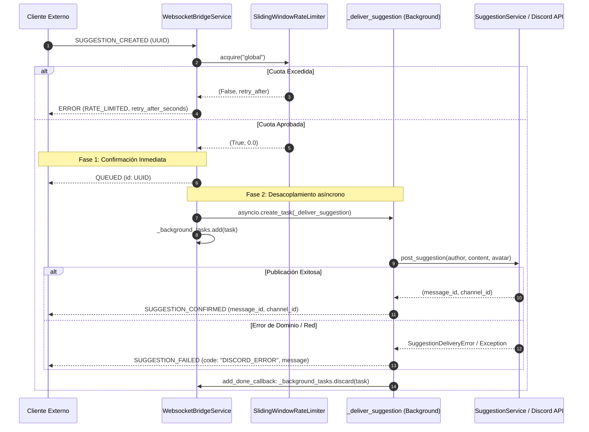

# Protocolo de Comunicación WebSocket Bridge

[⬅️ Volver a WebSocket Bridge](./README.md)

Este documento detalla la arquitectura de transporte, la estructura de tramas JSON, los códigos de operación (*opcodes*) y el protocolo de entrega en dos fases implementado en el servicio de pasarela WebSocket (`WebsocketBridgeService`) de **LigaBot**.

---

## 1. Arquitectura del Servidor

El componente `WebsocketBridgeService` (`src/liga_bot/services/websocket_bridge_service.py:27`) expone un servidor HTTP y WebSocket asíncrono embebido dentro del bucle de eventos principal de `asyncio` del bot, gestionado mediante `aiohttp.web`.

```
                  ┌──────────────────────────────────────────────┐
                  │                 LigaBot                      │
                  │  (discord.ext.commands.Bot / asyncio loop)   │
                  └──────────────────────┬───────────────────────┘
                                         │ setup_hook() / close()
                                         ▼
┌────────────────────────────────────────────────────────────────────────┐
│                        WebsocketBridgeService                          │
│                                                                        │
│   aiohttp.web.Application                                              │
│   ├── GET /health       ──> _handle_health()                           │
│   └── GET /ws/bridge    ──> _handle_ws()                               │
│                                                                        │
│   Concurrencia y Ciclo de Vida:                                       │
│   ├── _active_sockets: set[web.WebSocketResponse]                      │
│   ├── _background_tasks: set[asyncio.Task[Any]]                        │
│   ├── SlidingWindowRateLimiter (acquire("global"))                     │
│   └── SuggestionService.post_suggestion()                              │
└────────────────────────────────────────────────────────────────────────┘
```

### Endpoints Expuestos

| Ruta HTTP | Método | Tipo de Conexión | Descripción |
|---|---|---|---|
| `/ws/bridge` | `GET` | WebSocket (Upgrade RFC 6455) | Canal dúplex para autenticación, comandos de integración y entrega de sugerencias. |
| `/health` | `GET` | HTTP / JSON | Verificación de estado del bot y conteo de conexiones activas. |

### Configuración de Red y Puerto Efímero

El servicio se parametriza a través de `Settings` (`src/liga_bot/config.py:118-144`):
- `bridge_enabled` (`bool`, por defecto `True`): determina si el servidor se inicia en `setup_hook()`. Si es `False`, el servicio finaliza su inicialización sin levantar listeners de red.
- `bridge_host` (`str`, por defecto `"127.0.0.1"`): interfaz de red de escucha.
- `bridge_port` (`int`, por defecto `8765`): puerto TCP.
- **Resolución de puerto efímero**: la propiedad `port` (`src/liga_bot/services/websocket_bridge_service.py:61-67`) inspecciona el socket del `TCPSite` subyacente. Si se configura `bridge_port = 0`, el kernel asigna un puerto libre de forma dinámica, accesible mediante `service.port` sin colisiones durante ejecuciones de prueba paralelas.

### Endpoint de Salud (`/health`)

El endpoint `/health` implementa una sonda de disponibilidad (*liveness / readiness probe*) HTTP expuesta directamente sobre el servidor aiohttp del WebSocket Bridge (`src/liga_bot/services/websocket_bridge_service.py:81, 142-158`):

#### 1. Contrato de Verbos HTTP
- **Método Admitido**: Exclusivamente `GET` (`self._app.router.add_get("/health", self._handle_health)`).
- **Rechazo de Otros Verbos**: Cualquier petición utilizando otros métodos HTTP (como `POST`, `PUT`, `DELETE`, `PATCH` o `HEAD`) es rechazada automáticamente por el enrutador de aiohttp con código de estado HTTP `405 Method Not Allowed`.

#### 2. Nivel de Acceso y Autenticación
- **Acceso Público Irrestricto**: No requiere cabeceras de autorización, tokens secretos, supertokens ni apretones de manos (*handshakes*). A diferencia del canal `/ws/bridge`, cualquier cliente en la red local o proxy inverso puede consultar `/health` libremente.

#### 3. Precondiciones de Red y Ciclo de Vida
- **Dependencia de `bridge_enabled`**: El listener TCP HTTP/WS solo se instancia y vincula si la variable de configuración `bridge_enabled` es `True` (`src/liga_bot/bot.py:164-169`). Si `bridge_enabled = False`, el servidor HTTP/WS no se levanta durante `setup_hook` y cualquier intento de conexión TCP al puerto configurado será rechazado inmediatamente a nivel de kernel con `ECONNREFUSED`.
- **Resolución de Host y Puerto**: El endpoint escucha en `bridge_host` y `bridge_port` configurados (o el puerto efímero asignado si `bridge_port = 0`).

#### 4. Formato de Respuesta y Campos del Contrato
La respuesta se emite con código HTTP `200 OK` y cabecera `Content-Type: application/json`. El cuerpo JSON contiene exactamente los siguientes 4 campos:

```json
{
  "status": "ok",
  "bot_ready": true,
  "active_connections": 1,
  "connections": 1
}
```

- **`status`** (`str`): Literal constante `"ok"`, indicando que el servidor web local y su bucle de eventos están procesando peticiones.
- **`bot_ready`** (`bool`): Indicador booleano de disponibilidad del cliente Discord. Evalúa de forma no bloqueante `bot.is_ready()` (`getattr(self.bot, "is_ready", None)`); devuelve `True` únicamente cuando el bot ha completado el ciclo `on_ready` y su gateway se encuentra plenamente operativo, o `False` durante la fase de inicialización o reconexión.
- **`active_connections`** (`int`): Conteo exacto de clientes WebSocket actualmente conectados y autenticados en el bridge (`len(self._active_sockets)`).
- **`connections`** (`int`): Métrica de concurrencia sincronizada que refleja la cardinalidad activa de `self._active_sockets`.

---

## 2. Decodificación de Tramas y Extracción de UUID

La función canónica `extract_request_id(payload)` (`src/liga_bot/services/bridge_protocol.py:10-44`) procesa e identifica cada solicitud entrante antes de transferirla a la capa de comando.

### Formatos de Entrada Admitidos

1. Diccionario Python deserializado (`dict[str, Any]`).
2. Cadena JSON (`str`).
3. Secuencia de bytes (`bytes` o `bytearray` con codificación UTF-8).

Cualquier error de decodificación (`UnicodeDecodeError`, `JSONDecodeError`, `ValueError`, `TypeError`) es capturado de inmediato y devuelve `None`, desencadenando el descarte silencioso en la capa de transporte.

### Extracción Estricta del Identificador (`data.id`)

La extracción del identificador de correlación se realiza única y exclusivamente sobre la envoltura de transporte de red en `data.id`:

```
                      payload
                         │
                         ▼
                  ¿Es payload["data"] un dict?
                         │
              ┌──────────┴──────────┐
              ▼ Sí                  ▼ No
         raw_id = data.get("id")   return None
              │
              ▼
       ¿Es raw_id un str no vacío?
              │
       ┌──────┴──────┐
       ▼ Sí          ▼ No
   uuid.UUID()    return None
```

1. **`data.id`**: UUID RFC 4122 obligatorio para correlación asíncrona en la capa de transporte de red.
2. **`data.content`**: Contenedor exclusivo para los parámetros de negocio del comando.
3. **Validación Determinista**: Si `data.id` está ausente, no es una cadena de texto o no cumple con el estándar RFC 4122, la trama se rechaza devolviendo `None`.

### Validación y Normalización RFC 4122

- Se comprueba que `raw_id` sea de tipo `str` y no esté vacío tras aplicar `.strip()`.
- Se instancia `uuid.UUID(cleaned_id)`. Se admiten:
  - Formato estándar de 36 caracteres con guiones (`123e4567-e89b-12d3-a456-426614174000`).
  - Formato compacto de 32 caracteres hexadecimales continuos sin guiones (`123e4567e89b12d3a456426614174000`).
  - Caracteres en mayúsculas o minúsculas.
- Se serializa con `str(parsed_uuid)`, produciendo de forma determinista la representación canónica en **minúsculas de 36 caracteres con guiones**.

---

## 3. Códigos de Operación (Opcodes) y Esquemas de Tramas

El protocolo define los siguientes códigos de operación en formato JSON:

### 3.1 Cliente ➡️ Servidor

#### `LOGIN` / `LOG IN`
Autentica la sesión WebSocket con el supertoken secreto.

```json
{
  "type": "LOGIN",
  "data": {
    "id": "c0a80101-0000-4000-8000-000000000001",
    "content": {
      "token": "supertoken-secreto"
    }
  }
}
```

*Variantes admitidas para la ubicación del token:*
- `data.content.token` o `data.content.supertoken` (diccionario).
- `data.content` (cadena de texto plana).
- `data.token` (cadena de texto plana sobre el objeto `data`).

#### `SUGGESTION_CREATED`
Envía una sugerencia comunitaria para ser procesada y publicada en Discord.

```json
{
  "type": "SUGGESTION_CREATED",
  "data": {
    "id": "a1b2c3d4-e5f6-4a1b-8c2d-3e4f5a6b7c8d",
    "content": {
      "author_id": "123456789012345678",
      "author_username": "InvocadorEjemplo",
      "suggestion": "Añadir canal de repeticiones para la División 1.",
      "avatar_url": "https://cdn.discordapp.com/avatars/123/abc.png",
      "created_at": "2026-09-23T20:00:00Z"
    }
  }
}
```

*Campos y normalizaciones:*
- `author_id`: identificador del usuario (por defecto `"0"` si se omite).
- `author_username`: nombre de usuario (fallback a `username` o `"Anónimo"`).
- `suggestion`: contenido de la sugerencia (fallback a `content`).
- `avatar_url`: URL opcional para el avatar en el embed de Discord.
- `created_at`: marca temporal ISO 8601 opcional.

---

### 3.2 Servidor ➡️ Cliente

#### `LOGIN_SUCCESS`
Confirma la autenticación exitosa de la sesión.

```json
{
  "type": "LOGIN_SUCCESS",
  "data": {
    "id": "c0a80101-0000-4000-8000-000000000001",
    "status": "ok"
  }
}
```

*Comportamiento idempotente:* Si un cliente ya autenticado vuelve a enviar un comando `LOGIN` válido, el servidor responde nuevamente con `LOGIN_SUCCESS` confirmando la sesión activa.

#### `QUEUED` (Fase 1)
Confirmación síncrona inmediata que certifica la recepción de la sugerencia, la aprobación de cuota por el limitador de tasa y el encolado de la tarea en segundo plano.

```json
{
  "type": "QUEUED",
  "data": {
    "id": "a1b2c3d4-e5f6-4a1b-8c2d-3e4f5a6b7c8d"
  }
}
```

#### `SUGGESTION_CONFIRMED` (Fase 2 — Éxito)
Notificación asíncrona enviada una vez que la sugerencia ha sido publicada exitosamente en Discord y se han adjuntado las reacciones interactivas.

```json
{
  "type": "SUGGESTION_CONFIRMED",
  "data": {
    "id": "a1b2c3d4-e5f6-4a1b-8c2d-3e4f5a6b7c8d",
    "message_id": 987654321098765432,
    "channel_id": 123456789012345678
  }
}
```

- `message_id` (`int`): ID del mensaje de Discord generado con el embed.
- `channel_id` (`int`): ID del canal donde fue publicado.

#### `SUGGESTION_FAILED` (Fase 2 — Error)
Notificación asíncrona enviada si ocurre un error durante la publicación en Discord o si el servicio de sugerencias no está disponible.

```json
{
  "type": "SUGGESTION_FAILED",
  "data": {
    "id": "a1b2c3d4-e5f6-4a1b-8c2d-3e4f5a6b7c8d",
    "code": "DISCORD_ERROR",
    "message": "suggestions_channel_id no está configurado."
  }
}
```

#### `ERROR` (Límite de Tasa Excedido)
Respuesta síncrona enviada cuando la solicitud excede la capacidad de la ventana deslizante.

```json
{
  "type": "ERROR",
  "data": {
    "id": "a1b2c3d4-e5f6-4a1b-8c2d-3e4f5a6b7c8d",
    "code": "RATE_LIMITED",
    "retry_after_seconds": 12.4
  }
}
```

- `retry_after_seconds` (`float`): tiempo exacto en segundos que debe esperar el cliente para que expire la marca de tiempo más antigua de la ventana, redondeado a 1 decimal.

---

## 4. Protocolo de Sugerencias en Dos Fases

Para evitar bloquear la conexión WebSocket mientras se realizan llamadas de red a la API de Discord (creación de embeds, resolución de canales y registro de reacciones 👍/👎), el procesamiento se desacopla estrictamente en dos fases:



### Mecánica de Retención y Prevención de Fugas de Tareas

En Python `asyncio`, una tarea creada con `asyncio.create_task` cuya referencia no se conserve puede ser eliminada prematuramente por el recolector de basura (*garbage collector*). `WebsocketBridgeService` implementa una política de ciclo de vida hermética (`src/liga_bot/services/websocket_bridge_service.py:310-312`):

1. **Registro:** `self._background_tasks.add(task)` mantiene una referencia fuerte en el conjunto interno.
2. **Limpieza automática:** `task.add_done_callback(self._background_tasks.discard)` desasocia la tarea de memoria tan pronto como finaliza su ejecución, ya sea por éxito o por excepción.
3. **Resiliencia ante desconexión:** Si el cliente cierra el socket abruptamente mientras la tarea de fondo se ejecuta, las llamadas a `ws.send_json` verifican `not ws.closed` y capturan silenciosamente `(ConnectionResetError, RuntimeError)`, permitiendo que la entrega en Discord se complete sin generar excepciones no controladas.
